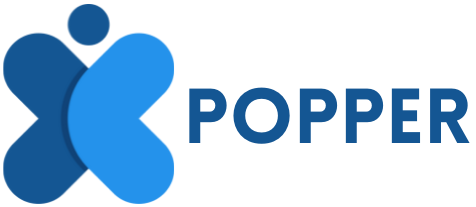

<div id="top"></div>

<!-- PROJECT LOGO -->
<br />
<div align="center">
  <a href="https://github.com/RahulBansal123/Popper/blob/main/public/assets/images/logo.png">
    
  </a>

  <h3 align="center">Popper</h3>

  <p align="center">
A membership platform that allows creators to build exclusive communities and developers to BUIDL with the best brains in the Web3.0 space.
    <br />
    <br />
    <a href="https://summer-king-4582.on.fleek.co/">View Demo</a>
    ·
    <a href="https://github.com/RahulBansal123/Popper/issues">Report Bug</a>
    ·
    <a href="https://github.com/RahulBansal123/Popper/issues">Request Feature</a>
  </p>
</div>


<!-- TABLE OF CONTENTS -->
<details>
  <summary>Table of Contents</summary>
  <ol>
    <li>
      <a href="#about-the-project">About The Project</a>
      <ul>
        <li><a href="#built-with">Built With</a></li>
      </ul>
    </li>
    <li>
      <a href="#getting-started">Getting Started</a>
      <ul>
        <li><a href="#prerequisites">Prerequisites</a></li>
        <li><a href="#installation">Installation</a></li>
      </ul>
    </li>
    <li><a href="#roadmap">Roadmap</a></li>
    <li><a href="#contributing">Contributing</a></li>
    <li><a href="#license">License</a></li>
    <li><a href="#contact">Contact</a></li>
  </ol>
</details>


<!-- ABOUT THE PROJECT -->
## About The Project

Popper is a (0% commission) membership based platform that allows creators to build exclusive communities and developers to BUIDL with the best brains in the Web3.0 space.

Users can subscribe to an exclusive gold/diamond level created by creators, and become a member of the elite community. They may also show their support for their favourite creative by clicking the "cheer" button connected to each of the creator's posts, which goes straight to the creator.

Popper utilises the lightening fast, minimual gas fees network of polygon to connect with its smart contracts and leverages IPFS technology (primarily the web3.storage service) to hold all of the post's images as well as their metadata and the metadata of each level decentrally and access it through the IPFS gateway.

The Popper website is currently hosted on Fleek.

Contracts are deployed at: [0x143880c71409a009c9448F3968C277C58495474f](https://mumbai.polygonscan.com/address/0x143880c71409a009c9448F3968C277C58495474f#code)

Link to video: [https://youtu.be/wuxFqCmcTf0](https://youtu.be/wuxFqCmcTf0)


<p align="right">(<a href="#top">back to top</a>)</p>


### Built With

This section should list any major frameworks/libraries used to bootstrap your project. Leave any add-ons/plugins for the acknowledgements section. Here are a few examples.

* Next.js
* Ethers.js
* Redux
* Truffle
* Polygon 
* Web3.Storage
* Fleek


<p align="right">(<a href="#top">back to top</a>)</p>


<!-- GETTING STARTED -->
## Getting Started

This is an example of how you may give instructions on setting up your project locally.
To get a local copy up and running follow these simple example steps.

### Prerequisites

This is an example of how to list things you need to use the software and how to install them.
* npm, truffle
  
### Installation

1. Get a free API Key at [https://web3.storage](https://web3.storage)
2. Clone the repo
   ```sh
   git clone [https://github.com/your_username_/Project-Name.git](https://github.com/RahulBansal123/Popper)
   ```
3. Install NPM packages
   ```sh
   npm install
   ```
4. Enter your API in `.env`
   ```js
   NEXT_PUBLIC_POPPER_STORAGE='ENTER YOUR API';
   ```
5. Enter your private key in `.secret` to deploy contracts on polygon testnet
6. Start the development server
   ```sh
   npm run dev
   ```

<p align="right">(<a href="#top">back to top</a>)</p>

<!-- ROADMAP -->
## Roadmap

- [x] Integrating IPFS
- [ ] Show the subscriptions of the user
- [ ] Creating a custom script/button to interact directly with Popper
- [ ] Multi-language Support
    - [ ] Chinese
    - [ ] Spanish

<p align="right">(<a href="#top">back to top</a>)</p>


<!-- CONTRIBUTING -->
## Contributing

Contributions are what make the open source community such an amazing place to learn, inspire, and create. Any contributions you make are **greatly appreciated**.

If you have a suggestion that would make this better, please fork the repo and create a pull request. You can also simply open an issue with the tag "enhancement".
Don't forget to give the project a star! Thanks again!

1. Fork the Project
2. Create your Feature Branch (`git checkout -b feature/AmazingFeature`)
3. Commit your Changes (`git commit -m 'Add some AmazingFeature'`)
4. Push to the Branch (`git push origin feature/AmazingFeature`)
5. Open a Pull Request

<p align="right">(<a href="#top">back to top</a>)</p>


<!-- LICENSE -->
## License

Distributed under the MIT License. See `LICENSE.txt` for more information.

<p align="right">(<a href="#top">back to top</a>)</p>


<!-- CONTACT -->
## Contact

Your Name - [@bansalXD]([https://twitter.com/your_username](https://twitter.com/BansalXD)) - rbbansal558@gmail.com

Project Link: [https://github.com/RahulBansal123/Popper]([https://github.com/your_username/repo_name](https://github.com/RahulBansal123/Popper))

<p align="right">(<a href="#top">back to top</a>)</p>


<p align="right">(<a href="#top">back to top</a>)</p>
